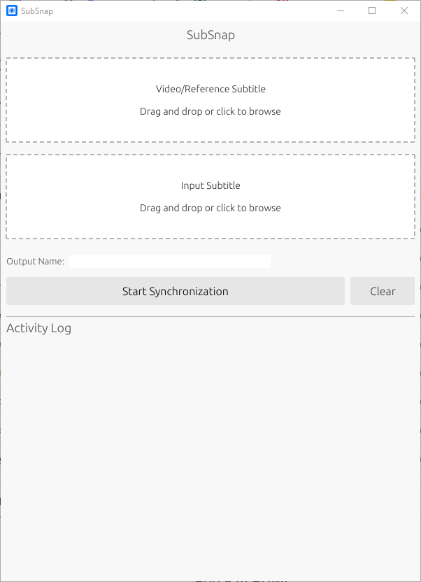

# SubSnap

A desktop app to align subtitle files (.srt, etc.) with video or other subtitle files.



## How it works

The tool extracts audio from the video and uses Voice Activity Detection (VAD) to find when people are talking. It then uses FFT-based alignment to match the timings in your subtitle file to the actual audio.

- Supports video files (MP4, MKV, AVI, etc.)
- Supports subtitle-to-subtitle synchronization
- Fast multi-threaded processing
- Simple drag-and-drop interface

## Usage

1. **Select Reference**: Drop a video to fix subtitle using audio into the first box.
2. **Select Target**: Drop the subtitle file you want to fix into the second box.
3. **Synchronize**: Click "Start Synchronization". The fixed file will be saved in the same folder as the original.

## Build

Requires the Rust toolchain.

```bash
git clone https://github.com/msenturk/subsnap
cd subsnap
cargo run --release
```

## Credits

- `alass-core` for the alignment engine
- `eframe` for the GUI
- `symphonia` for audio decoding
- `webrtc-vad` for voice activity detection

## License

MIT
